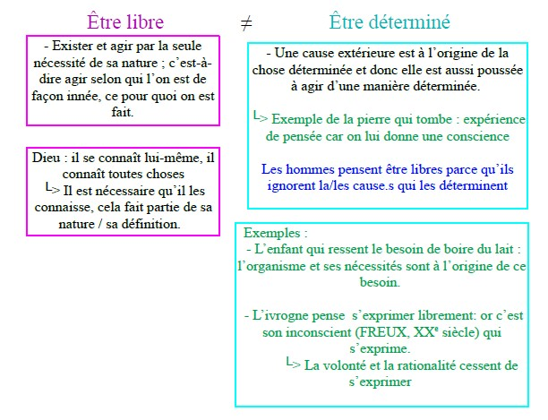

<meta chartes="utf-8" />
<html>
 <head>
 <meta name="viewport" content="width=device-width, initial-scale=1">
 
 </head>

 <body>
 <h1 id="para1">COMMENT PEUT-ON DEFINIR LA LIBERTE?</h1>
 <h2 id="para2">Comment peut-elle s'exprimer?</h2>
    
  
  <ol style="liste-style-type:lower-alpha">
     <li id="para3"> &nbsp;&nbsp; &nbsp;&nbsp; La liberté d’indépendance : c’est le fait de ne dépendre de rien (substance) ni de personne. </li>
     <li id="para3"> &nbsp;&nbsp; &nbsp;&nbsp; La liberté d’indifférence : la capacité pour un individu de choisir parmi plusieurs possibilités qui se présentent à lui, n’importe laquelle d’entre elles, en toute indifférence, sans avoir une raison particulière de faire tel ou tel choix.  &nbsp;&nbsp; &nbsp;&nbsp; Cette capacité démontre que l’Homme est doué d’un <b><u>libre arbitre </u></b>  et qu’il n’est pas déterminé par avance dans ces choix.    &nbsp;&nbsp; &nbsp;&nbsp;  → Le dilemme de l’âne de BURIDAN selon laquelle un âne ayant aussi soif que faim, placé à égale distance d’un seau d’avoine et d’eau, serait mort de soif et de faim, faute de choisir par quoi commencer. &nbsp;&nbsp; &nbsp;&nbsp; └> Expérience de pensée pouvant l’existence de la liberté d’indifférence.   Pour René DESCARTES, il s’agit du plus bas degré de liberté. </li>
     <li id="para3"> &nbsp;&nbsp; &nbsp;&nbsp;Le libre arbitre : la capacité dont dispose la<b><i> volonté </i></b>d’effectuer un choix<b><i> par elle-même</i></b> (penser par soi-même), de choisir selon <b><i>des motifs</i></b> telle ou telle chose   &nbsp;&nbsp; &nbsp;&nbsp;⇒ Rationalité (nos choix sont argumentés)   &nbsp;&nbsp; &nbsp;&nbsp; → S’oppose au déterminisme et ou fatalisme pour lesquels la volonté serait déterminé par des «forces» extérieurs que l’Homme ne maîtrise pas. </li>     
     <li id="para3"> &nbsp;&nbsp; &nbsp;&nbsp; Autonomie (en grec : « αὐτονομία »)  &nbsp;&nbsp; &nbsp;&nbsp;  &nbsp;&nbsp; du grec : autos → par soi-même  &nbsp;&nbsp; &nbsp;&nbsp;  &nbsp;&nbsp; &nbsp;&nbsp; nomos → la règle , la loi  &nbsp;&nbsp; &nbsp;&nbsp;└> se donner à soi-même sa propre loi → Penser par soi-même
       &nbsp;&nbsp; &nbsp;&nbsp; &nbsp;&nbsp; &nbsp;&nbsp; &nbsp;&nbsp; &nbsp;&nbsp; &nbsp;&nbsp; &nbsp;&nbsp; &nbsp;&nbsp; &nbsp;&nbsp; &nbsp;&nbsp; &nbsp;&nbsp; &nbsp;&nbsp; &nbsp;&nbsp; &nbsp;&nbsp; &nbsp;&nbsp; └> Agir pour soi-même / engagement
        &nbsp;&nbsp; &nbsp;&nbsp; └> <b><i>La volonté</i></b> sait résister aux penchants, à ses désirs, pour suivre <b><i>la raison</i></b>.
       </li>
     <li id="para3"> &nbsp;&nbsp; &nbsp;&nbsp; La liberté politique : → Les libertés politiques qui dépendent des États   &nbsp;&nbsp; &nbsp;&nbsp; &nbsp;&nbsp; &nbsp;&nbsp;En démocratie, elle se définit comme l’exercice de la souveraineté par le <b><i>peuple</i></b>, à travers les lois, lorsque celles-ci incarnent <b><i>la volonté générale</i></b>.</li>
 </ol>
    

 
<u><b>Baruch SPINOZA, <i>Traité Politique (La lettre à SCHULLER)</i>, XVIIe siècle (P.266-267)</b></u>

   <button type="button" class="collapsible">
<b>Baruch SPINOZA</b>, <i>Traité Politique (La lettre à SCHULLER)</i>, XVIIe siécle  Qu'est-ce que vouloir?
  </button>
  
 

  
<i>Nous nous sentons libres à chaque fois que nous pouvons faire ce que nous voulons. Ce sentiment de liberté grandit, par exemple, sous l’effet de l’alcool : le timide se sent soudain libéré et devient loquace, l’avare oublie de compter son argent… Mais ne se 
 sentent-ils pas d’autant plus libres qu’ils sont en réalité sous dépendance de la boisson ? Suffit-il de vouloir quelque chose pour vouloir librement ?</i>
   
   &nbsp;&nbsp; &nbsp;&nbsp;&nbsp;&nbsp; &nbsp;&nbsp;  J’appelle libre, quant à moi, une chose qui est et agit par la seule nécessité de sa
   &nbsp;&nbsp; &nbsp;&nbsp;&nbsp;&nbsp; &nbsp;&nbsp;  nature ; contrainte, celle qui est déterminée par une autre à exister et à agir d’une
   &nbsp;&nbsp; &nbsp;&nbsp;&nbsp;&nbsp; &nbsp;&nbsp; certaine façon déterminée.Dieu, par exemple, existe librement bien que nécessairement
   &nbsp;&nbsp; &nbsp;&nbsp; &nbsp;&nbsp; &nbsp; parce qu’il existe par la seule nécessité de sa nature. De même aussi Dieu 
   5 &nbsp;&nbsp; &nbsp;&nbsp;&nbsp;&nbsp; se connaît lui-même librement parce qu’il existe par la seule nécessité de sa nature. 
   &nbsp;&nbsp; &nbsp;&nbsp;&nbsp;&nbsp; &nbsp;&nbsp;  De même aussi Dieu se connaît lui-même et connaît toutes choses librement, parce 
   &nbsp;&nbsp; &nbsp;&nbsp;&nbsp;&nbsp; &nbsp;&nbsp; qu’il suit de la seule nécessité de sa nature que Dieu connaisse toutes choses. Vous 
   &nbsp;&nbsp; &nbsp;&nbsp;&nbsp;&nbsp; &nbsp;&nbsp;&nbsp;le voyez bien, je ne fais pas consister la liberté dans un libre décret mais dans une
   &nbsp;&nbsp; &nbsp;&nbsp; &nbsp;&nbsp; &nbsp;&nbsp; libre nécessité.
   
   10&nbsp;&nbsp;&nbsp;&nbsp; &nbsp;Mais descendons aux choses créées qui sont toutes déterminées par des causes
   &nbsp;&nbsp; &nbsp;&nbsp;&nbsp;&nbsp; &nbsp;&nbsp;  extérieures à exister et à agir d’une certaine façon déterminée. Pour rendre cela 
   &nbsp;&nbsp; &nbsp;&nbsp;&nbsp;&nbsp; &nbsp;&nbsp; clair et intelligible, concevons une chose très simple : une pierre par exemple reçoit
   &nbsp;&nbsp; &nbsp;&nbsp;&nbsp;&nbsp; &nbsp;&nbsp; d’une cause extérieure qui la pousse, une certaine quantité de mouvements et, l’impulsion
   &nbsp;&nbsp; &nbsp;&nbsp; &nbsp;&nbsp; &nbsp;&nbsp;de la cause extérieure venant à cesser, elle continuera à se mouvoir nécessairement. 
   15 &nbsp;&nbsp; &nbsp;&nbsp;Cette persistance de la pierre dans le mouvement est une contrainte, 
   &nbsp;&nbsp; &nbsp;&nbsp;&nbsp;&nbsp; &nbsp;&nbsp;  non parce qu’elle est nécessaire, mais parce qu’elle doit être définie par l’impulsion 
   &nbsp;&nbsp; &nbsp;&nbsp;&nbsp;&nbsp; &nbsp;&nbsp; d’une cause extérieure. Et ce qui est vrai de la pierre il faut l’entendre de toute chose 
   &nbsp;&nbsp; &nbsp;&nbsp;&nbsp;&nbsp; &nbsp;&nbsp;singulière, quelle que soit la complexité qu’il vous plaise de lui attribuer, si nombreuses
   &nbsp;&nbsp; &nbsp;&nbsp; &nbsp;&nbsp; &nbsp;&nbsp; que puissent être ses aptitudes, parce que toute chose singulière est nécessairement
   20 &nbsp;&nbsp; &nbsp;&nbsp; déterminée par une cause extérieure à exister et à agir d’une certaine
   &nbsp;&nbsp; &nbsp;&nbsp;&nbsp;&nbsp; &nbsp;&nbsp;   manière déterminée.
   
   &nbsp;&nbsp; &nbsp;&nbsp;&nbsp;&nbsp; &nbsp;&nbsp; Concevez maintenant, si vous voulez bien, que la pierre, tandis qu’elle continue de 
   &nbsp;&nbsp; &nbsp;&nbsp;&nbsp;&nbsp; &nbsp;&nbsp;se mouvoir, pense et sache qu’elle fait effort, autant qu’elle peut, pour se mouvoir.
   &nbsp;&nbsp; &nbsp;&nbsp; &nbsp;&nbsp; &nbsp;&nbsp;Cette pierre assurément, puisqu’elle a conscience de son effort seulement et qu’elle 
   25&nbsp;&nbsp; &nbsp;&nbsp;&nbsp;n’est en aucune façon indifférente, croira qu’elle est très libre et qu’elle ne persévère
   &nbsp;&nbsp; &nbsp;&nbsp;&nbsp;&nbsp; &nbsp;&nbsp;   dans son mouvement que parce qu’elle le veut. Telle est cette liberté humaine que 
   &nbsp;&nbsp; &nbsp;&nbsp;&nbsp;&nbsp; &nbsp;&nbsp; tous se vantent de posséder et qui consiste en cela seul que les hommes ont conscience
   &nbsp;&nbsp; &nbsp;&nbsp;&nbsp;&nbsp; &nbsp;&nbsp; de leurs appétits et ignorent les causes qui les déterminent. Un enfant croit librement 
   &nbsp;&nbsp; &nbsp;&nbsp; &nbsp;&nbsp; &nbsp;&nbsp;appéter le lait, un jeune garçon irrité vouloir se venger et, s’il est poltron,
   30&nbsp;&nbsp; &nbsp;&nbsp; vouloir fuir. Un ivrogne croit dire par un libre décret de son âme ce qu’ensuite,
   &nbsp;&nbsp; &nbsp;&nbsp;&nbsp;&nbsp; &nbsp;&nbsp; revenu à la sobriété, il aurait voulu taire. De même un délirant, un bavard, et bien 
   &nbsp;&nbsp; &nbsp;&nbsp;&nbsp;&nbsp; &nbsp;&nbsp;d’autres de même farine, croient agir par un libre décret de l’âme et non se laisser 
   &nbsp;&nbsp; &nbsp;&nbsp;&nbsp;&nbsp; &nbsp;&nbsp;contraindre. Ce préjugé étant naturel, congénital parmi tous les hommes, ils ne
   &nbsp;&nbsp; &nbsp;&nbsp;&nbsp;&nbsp; &nbsp;&nbsp; s’en libèrent pas aisément. Bien qu’en effet l’expérience enseigne plus que suffisamment 
   35&nbsp;&nbsp; &nbsp;&nbsp;que, s’ils est une chose dont les hommes soient peu capables , c’est de régler
   &nbsp;&nbsp; &nbsp;&nbsp;&nbsp;&nbsp; &nbsp;&nbsp; leurs appétits et, bien qu’ils constatent que partagés entre deux affections contraires,
   &nbsp;&nbsp; &nbsp;&nbsp;&nbsp;&nbsp; &nbsp;&nbsp;souvent ils voient le meilleur et font le pire, ils croient cependant qu’ils sont libres, 
   &nbsp;&nbsp; &nbsp;&nbsp;&nbsp;&nbsp; &nbsp;&nbsp;et cela parce qu’il y a certaines choses n’excitant en eux qu’un appétit léger, aisément
   &nbsp;&nbsp; &nbsp;&nbsp;&nbsp;&nbsp; &nbsp;&nbsp;maitrisé par le souvenir fréquemment rappelé de quelque autre chose.
 

 

 

  
 
  
 
Appétit (chez SPINOZA) : c’est un <i>conatus</i> qui se rapporte aussi bien ou corps qu’à l’intellect.
  <i>Conatus </i>: une chose en tant qu’elle s’efforce de persévérer dans son être, c’est-à-dire tout ce qu’elle peut faire pour déployer son être.
  
  &nbsp;&nbsp; &nbsp;&nbsp; &nbsp;&nbsp;→ L’Homme n’agit ou ne décide pas selon sa rationalité, la plupart du temps,mais selon ses désirs.
  &nbsp;&nbsp; &nbsp;&nbsp; &nbsp;&nbsp;Ainsi, il est poussé à désirer quelque chose non pas parce qu’elle est bonne, mais c’est parce qu’il la désire qu’il la trouve bonne.
   <i style="color:#0000FF;">« Nous ne désirons pas une chose parce que nous la jugeons [rationalité (argument)] bonne, mais nous la jugeons bonne parce que nous la désirons »</i>
   &nbsp;&nbsp; &nbsp;&nbsp; &nbsp;&nbsp; &nbsp;&nbsp;&nbsp;&nbsp; &nbsp;&nbsp; &nbsp;&nbsp; &nbsp;&nbsp;&nbsp;&nbsp; &nbsp;&nbsp; &nbsp;&nbsp; &nbsp;&nbsp;&nbsp;&nbsp; &nbsp;&nbsp; &nbsp;&nbsp; &nbsp;&nbsp;&nbsp;&nbsp; &nbsp;&nbsp; &nbsp;&nbsp; &nbsp;&nbsp;&nbsp;&nbsp; &nbsp;&nbsp; &nbsp;&nbsp; &nbsp;&nbsp;&nbsp;&nbsp; &nbsp;&nbsp; &nbsp;&nbsp; &nbsp;&nbsp;&nbsp;&nbsp; &nbsp;&nbsp; &nbsp;&nbsp; &nbsp;&nbsp;&nbsp;&nbsp; &nbsp;&nbsp; &nbsp;&nbsp; &nbsp;&nbsp;&nbsp;&nbsp; &nbsp;&nbsp; &nbsp;&nbsp; &nbsp;&nbsp;&nbsp;&nbsp; &nbsp;&nbsp;&nbsp;&nbsp; &nbsp;&nbsp;<i>SPINOZA</i>
   &nbsp;&nbsp; &nbsp;&nbsp; &nbsp;&nbsp;   └> Lien liberté et désir : les deux s’opposent car on ne connaît pas l’origine de nos désirs (la plupart du temps nous n’en sommes pas les auteurs) + le désir est sans fin, incontournable.
    &nbsp;&nbsp; &nbsp;&nbsp; &nbsp;&nbsp;  Donc suivre ses désirs, c’est renoncer à sa liberté.
 

   

 
 Veuillez trouver la version PDF de ce cours ci-dessous  😇 

  
  <a href="image/Comment_peut-on_définir_la_liberté.pdf" dowload="">
Cliquer ici pour télécharger!
</a>
    
 <embed type="application/pdf" src="image\Comment_peut-on_définir_la_liberté.pdf" width="1000" height="1500" />

 

 </body>
